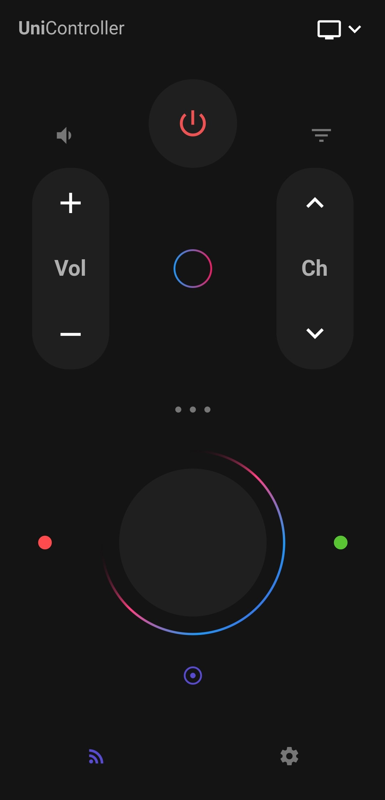
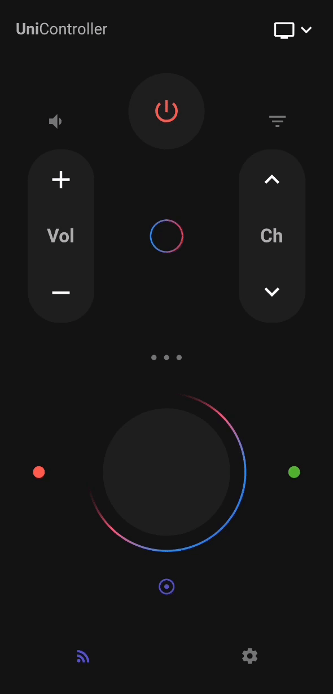
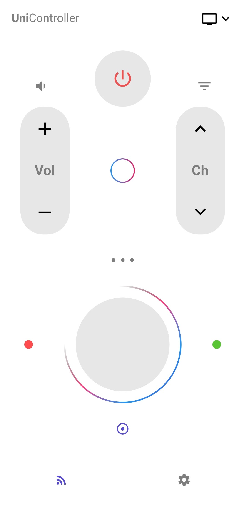

# Smart controller remote app UI TEMPLATE

This is a flutter template for a smart universal controller inspired from [Jitu Raut](https://dribbble.com/jituraut)'s [design](https://dribbble.com/shots/5960398-Smart-controller-remote-app).

## 📸 Screenshots

Dark | Gif | Light | 
:-------------------------:|:-------------------------:|:-------------------------:|
 | | 

## Authors

* **Skender Lahdhiri** - *flutter template* - [Github](https://github.com/skenderl)
* **Jitu Raut** - *inspiration* - [dribbble](https://dribbble.com/jituraut)

## License

This project is licensed under the MIT License - see the [LICENSE.md](LICENSE.md) file for details
